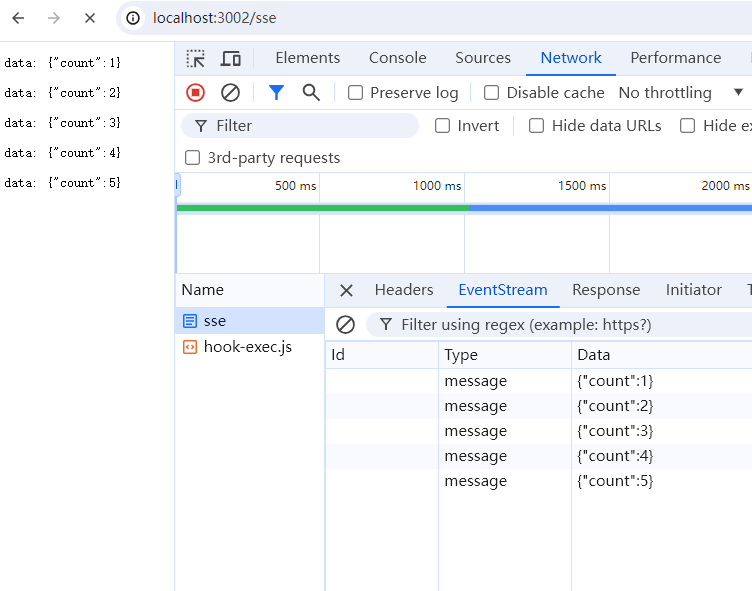
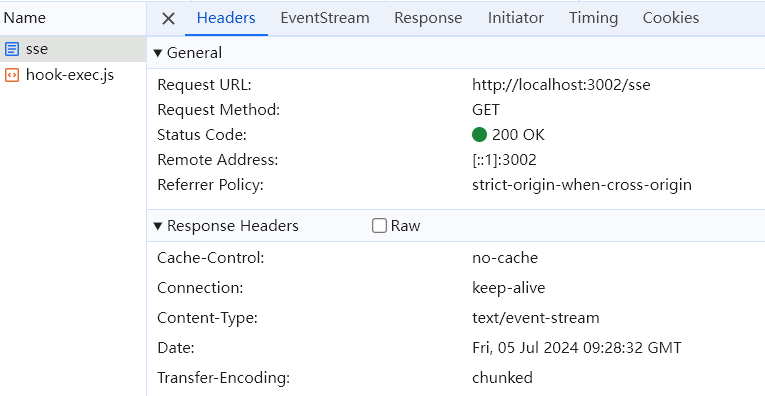

## Introduction

This is a simple example of using Server-Sent Events (SSE) with Koa.js. It uses the `koa-sse` package to handle the server-sent events.


## Usage

### Install dependencies

```
npm install
```


### Start the server

```
npm run dev
```

## View the server-sent events in the browser

Open the browser and go to `http://localhost:3002/sse`. You should see a stream of server-sent events being generated.




